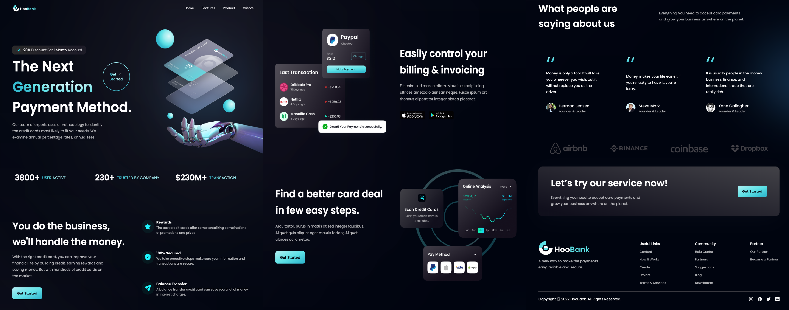

<div align="center">

# HooBank - Modern Bank Website 🌐

HooBank is a **modern, fully responsive banking website UI/UX** built with **React, Vite, and TailwindCSS**. This project is designed to showcase a sleek, user-friendly banking platform with engaging animations and smooth interactions.

</div>

---

<div align="center">

### 🛠 Built With

[](https://react.dev/)
[](https://vitejs.dev/)
[](https://tailwindcss.com/)
[](https://www.framer.com/motion/)
[](https://vercel.com/)

</div>

---

## 🧠 Overview

**HooBank** is a fully responsive and animated banking website UI/UX built for modern digital finance platforms.  
It highlights key features, client testimonials, service offerings, and call-to-action elements — all crafted with a clean and scalable React + TailwindCSS structure.

Inspired by [JavaScript Mastery](https://www.youtube.com/@javascriptmastery), this project is ideal for frontend developers and UI designers who want to practice modern frameworks, build clean UI/UX layouts, and explore scalable React projects.

---

## 📸 Demo



---

## 🌐 Live Demo

[](https://bank-modern-website-ten.vercel.app/)

---

### 🔍 Highlights

- ✅ Responsive design
- ✅ Smooth animations and transitions
- ✅ Reusable UI components
- ✅ Content-managed sections
- ✅ Scalable, modular codebase
- ✅ Beautiful visuals and interactive elements

---

## 🚀 Features

- 🧭 **Dynamic Navigation Bar** – Responsive and styled navigation with mobile menu toggle
- 🖼️ **Animated CTA and Hero Sections** – Includes tilt effects and smooth text transitions
- 🧠 **Section-based Layout System** – Clearly organized sections like Billing, Business, Testimonials, etc.
- 🧱 **Tailwind Utility-First Architecture** – Easy to style and customize component layouts
- 📊 **Stat and Feedback Visuals** – Engaging data display through stats and testimonial cards
- 🔄 **Intersection Observer Animations** – Scroll-based reveal effects for content visibility

---

## 📂 Project Structure

```bash
📦 src/
├── assets/           # Images and icons (logos, screenshots, gradients)
├── components/       # Reusable UI components (Navbar, Hero, Stats, CTA, etc.)
├── constants/        # Static data (navigation links, features, feedbacks, stats, social links)
├── styles/           # TailwindCSS configurations and global style utilities
├── App.jsx           # Main App component that sets up routing and page structure
├── main.jsx          # React entry point (root rendering)
```

---

## 🛠️ Technologies Used

- **React** – Component-based UI library
- **Vite** – Fast build tool for React applications
- **TailwindCSS** – Utility-first CSS framework
- **Framer Motion** – For smooth animations
- **React Icons** – Modern and customizable icons

---

## 📦 Installation & Setup

1. **Clone the repository:**

   ```sh
   git clone https://github.com/Oran01/Bank-Modern-Website.git
   cd Bank-Modern-Website

   ```

2. **Install dependencies:**

   ```sh
   npm install
   ```

3. **Start the development server:**

   ```sh
   npm run dev
   ```

4. Open [http://localhost:5173] (<http://localhost:5173>) in your browser.

---

## 📺 Based on JavaScript Mastery

This project was built by following the **JavaScript Mastery** tutorial:
🔗 [YouTube Video](https://www.youtube.com/watch?v=_oO4Qi5aVZs&t=8005s)

---

## 🤝 Contributing

Feel free to fork this repository and submit pull requests to improve the project!

⭐ If you enjoyed this project, please consider giving it a star!
